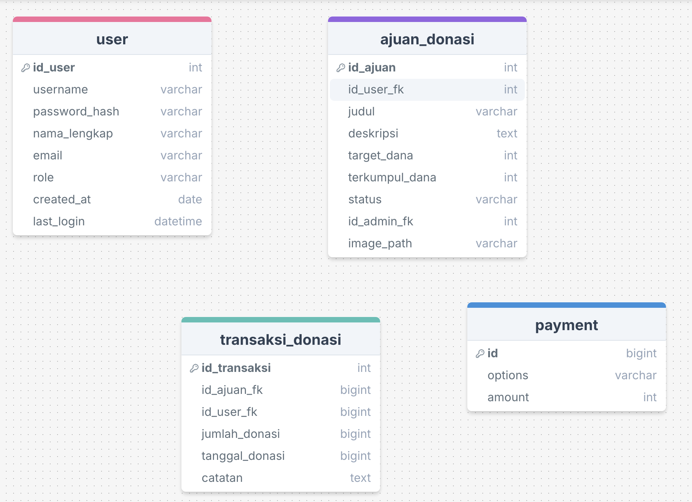
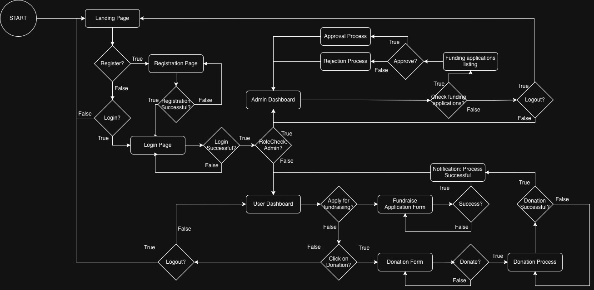
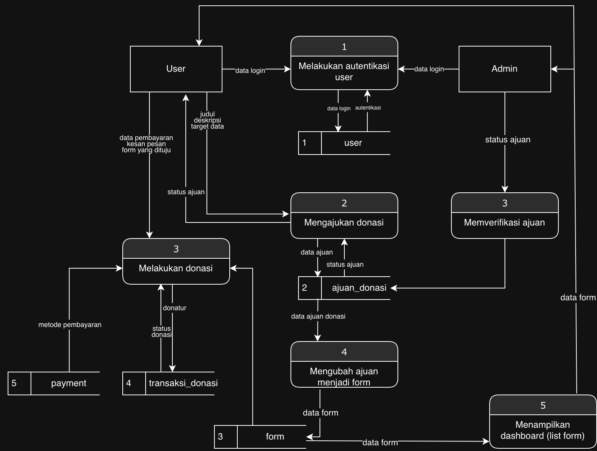

# FundFlow
Final Project Web Programming. 
Online donation system that allows submitting donation requests and making donations, with user and admin management to separate functions and authorization.

Kelompok 18 :
| Nama           |    
| ---            |    
| Qurrata Ayun Kamil |   
| Bintang Ilham Pabeta | 
| Hartmann Kanisius Galla' Massang | 

## Local Setup
```
cd "\path\to\project"
composer install
```
Also setup :
 ``` .envexample ```

## Implementation

### 1. Frontend and Backend Development
#### A. Frontend Development

This project Frontend is build using CSS + HTML with bootstrap integration for it's grid system.

**Pages**

1. **Landing Page:** Hero section with _parralax effect_, user guide, and fitured campaigns.
3. **User Dashboard:** Pending requested campaign and view active campaigns.
4. **Admin Dashboard:** Processing requested campaign.
5. **Donation Details:** Mentions donation details and donation forms.
5. **4 Forms:** Login/Register pages, fundraise submission, and a payment page with a countdown timer.
    
#### B. Backend Development

1. Authentication Module (`/be/auth`)

This module is fully responsible for managing user identity, ensuring session security, and determining access rights (role). All files in this module interact closely with the `user` table and utilize PHP Sessions to maintain the login state.

| File | Core Feature | Technical Explanation |
| :--- | :--- | :--- |
| `register.php` | Account Registration | Receives `username`, `email`, and `password`. Performs input validation, checks for duplicate usernames or emails, encrypts the password using `password_hash()`, and saves the data to the `user` table. |
| `login.php` | Account Login | Receives `email` and `password`. Searches for the user by email, verifies the password with `password_verify()`. If successful, it creates a new session (`session_regenerate_id()`), stores `user_id` and `role` in `$_SESSION`, and returns the login status (including the role). |
| `check.php` | Session Check | Verifies if the PHP session is active and contains the `user_id`. Retrieves user data from the DB, and returns the information of the currently logged-in user (including their role). Used by the Frontend to determine which page to access (`admin-dashboard.html` or `user-dashboard.html`). |
| `logout.php` | Account Logout | Destroys the session (`session_destroy()`), effectively logging the user out of the system. |
| `session.php` | Session & CORS Configuration | A helper file required by every endpoint. It initializes `session_start()` and sets the CORS (Cross-Origin Resource Sharing) headers so the API can be accessed by the frontend, which may be running on a different port or domain (e.g., `localhost:5173`). |

---

2. Campaign/Fundraising Submission Module (`/be/campaigns`)

This module manages the lifecycle of fundraising submissions created by users. It interacts with the `ajuan_donasi` table.

| File | Core Feature | Technical Explanation |
| :--- | :--- | :--- |
| `create.php` | Create New Campaign | Requires a logged-in user (`id_user_fk`). Receives campaign details (`judul`, `deskripsi`, `target_dana`, `image_path`). Saves the data to `ajuan_donasi` with an initial status of **'Pending'**. |
| `list.php` | Campaign List | By default, retrieves all campaigns with the **'Verified'** status (for public/general dashboard view). It can also retrieve campaigns belonging to the currently logged-in user (filtered by `id_user_fk`). |
| `get.php` | Campaign Detail | Retrieves the details of a specific campaign based on its `id_ajuan`. Used for the `donation-detail.html` page. |
| `update.php` | Edit Campaign / Appeal | Allows the user (campaign owner) to edit campaign details. If the campaign status is **'Rejected'** and the user makes changes, the campaign status will be changed back to **'Pending'** (Appeal mechanism). |
| `delete.php` | Delete Campaign | Allows the user (campaign owner) to delete their fundraising submission. |

---

3. Admin Module (`/be/admin`)

This module contains functions that are **only accessible by users with the 'admin' role**. It modifies the status in the `ajuan_donasi` table and populates the `id_admin_fk` column.

| File | Core Feature | Technical Explanation |
| :--- | :--- | :--- |
| `pending.php` | List Pending | Retrieves a list of all campaigns with the **'Pending'** or **'Rejected'** status so the Admin can conduct reviews or view rejection history. |
| `approve.php` | Approve Campaign | Changes the campaign status from 'Pending' to **'Verified'**. Populates the `id_admin_fk` column with the ID of the admin who performed the approval. |
| `reject.php` | Reject Campaign | Changes the campaign status to **'Rejected'**. Populates the `id_admin_fk` column with the ID of the admin who performed the rejection. |

4. Donation Module (`/be/donations`)

This module handles donation transactions and updates the funds collected. It interacts with the `transaksi_donasi` and `ajuan_donasi` tables.

| File | Core Feature | Technical Explanation |
| :--- | :--- | :--- |
| `process.php` | Process Donation | The most critical module. Runs within a **database transaction** (`BEGIN TRANSACTION`). First, it logs the donation to the `transaksi_donasi` table (requiring `id_user_fk` based on the DB schema), then updates the total `terkumpul_dana` in the related `ajuan_donasi` table. If both steps succeed, the transaction is committed. |
| `list.php` | Donor List | Retrieves all donation entries from the `transaksi_donasi` table for a specific `id_ajuan`. This allows for the display of the donor feed on the campaign detail page. |

### 2. Database Implementation

Database ERD



### 3. Integrasi API

API Xendit

### 4. Pengujian (Testing)

Postman

## Diagram Sistem

1. User Flow Diagram


2. Data Flow Diagram


## User Guide

Step-by-step instructions for using the main features of FundFlow!

### 1. Registration and Login
1. Navigate the navbar to open Registration/Login page.
2. Fill in your personal details (Username, Email, Phone Number, Password) and click **Register**.
4. Once successful, log in using your email and password on the Login page.

### 2. How to Donate?
1.  Go to the **User Dashboard** or **Landing Page**.
2.  Select a campaign you wish to support in the *"Help Them!"* section.
3.  Click the **Donate** button.
4.  On the detail page:
    *   Select a donation amount (Rp 10,000, Rp 20,000, etc.) or enter a manual amount.
    *   (Optional) Write a message or prayer of support.
    *   Select a payment method (Bank Transfer / QRIS).
5.  Click **Continue to Payment**.
6.  Complete the payment before the *countdown timer* runs out, then click **Confirm Payment**.

### 3. Adding Fundraise
1.  Ensure you are logged in.
2.  Click the **Open Fundraise** button on the top navigation menu.
3.  Complete the submission form:
    *   Donation Title and Description.
    *   Target funds required.
    *   Upload a cover image.
4.  Click **Submit Donation**. Your submission status will appear on the Dashboard as *"Pending"*.

### 4. Admin Management (Verification)
1.  Log in using an account with Admin access.
2.  On the **Admin Dashboard**, review the list of incoming donation submissions.
5.  The admin's decision will be immediately visible on the respective user's dashboard.

## Pembagian Jobdesk

- UI/UX : (Quratta)
- Front-End : (Hartmann & Quratta)
- Back-end : (Hartmann & Bintang)
- Diagram (UFD,DFD,ERD) : (Bintang)
- Database & Payment Gateway : (Hartmann)
